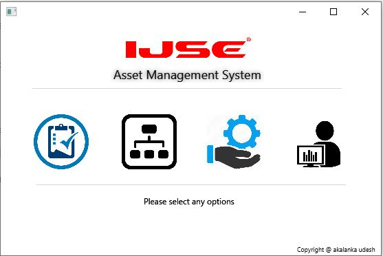
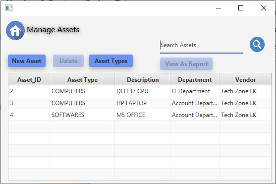
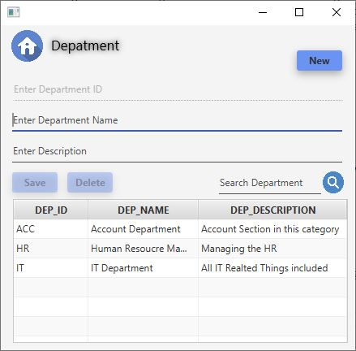
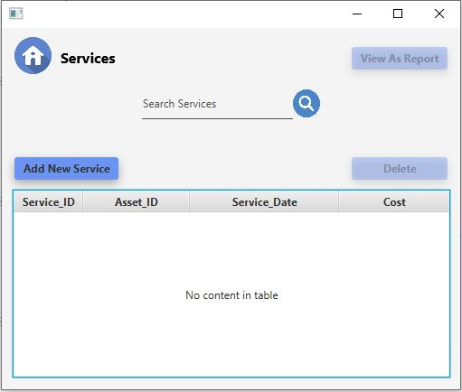
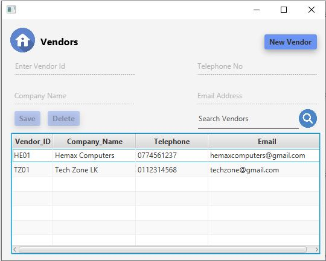

# Asset Manager -JAVAFX

Asset Manager is an management software tool to manage organizational assets. It has ability to maintain a record from current assets and their services. By monitoring the assets it's very easy to maintain them. This software main interface consists of four main parts:

    ⋅⋅*Assets
    ⋅⋅*Department
    ⋅⋅*Services
    ⋅⋅*Vendors
    
 

## Assets

In this page menu you can add a new asset, search asset, add new asset types and delete assets. All of those functionalities include in the **asset** section.

  

 ## Department

 In this sectio you can add a new department for the organization. Because when we are going to add a new asset it's required a department.

 

 ## Services 

 Service section will allow to maintain a services to the current assets. This has include add services,search srvices and update services functionalities.

## Vendors

Vendor tab facilitate to add new vendors, search vendors and delete vendors. This tab helps to maintain our suppliers/vendor details.

